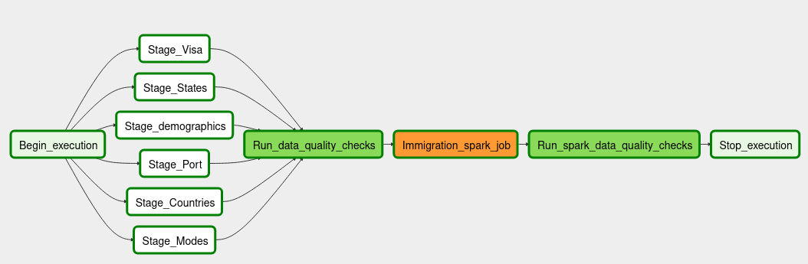
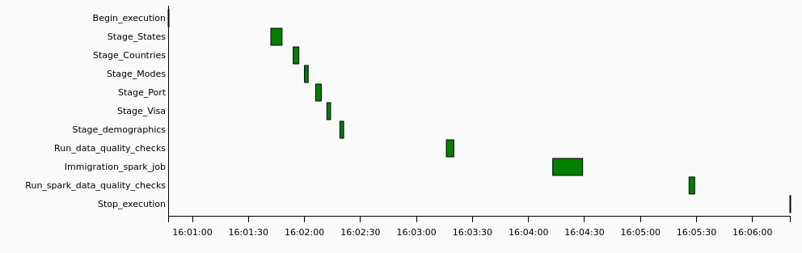
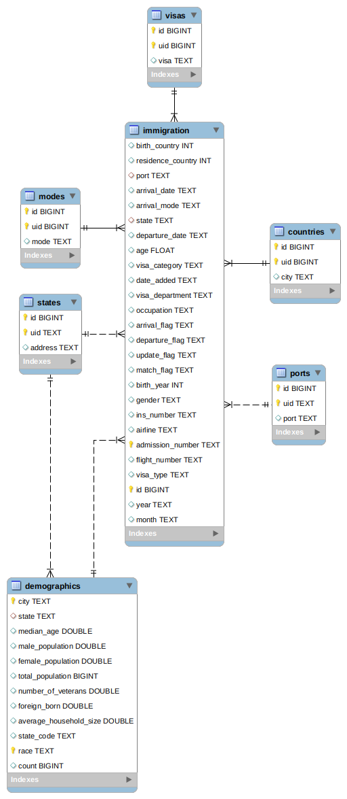

# Immigration datalake - Udacity Capstone Project

The objective of this project is to create an ETL pipeline to load immigration and demographics data into a data lake
hosted in S3. Data Lake is configured to use parquet files, allowing for data partition by date and state. This data
might be used to study the relation of immigration and demographic data in the US.

## ETL

1. Dimention tables are staged from local files in `data` at independent processes, initial data 
   is stored with the columns: `code`, `value` as a key value pair. Tables are read and converted to the
   following format: `id`, `uid`, `<col_name>`. 
   - `id` build from entry position
   - `uid` mapped from `code`
   - `<col_name>` depends on the dimention table, but maps the `value` field
    
   Constructed dataframes are staged to S3 as parquet files

2. A Data quality check is run to ensure that parquet files were uploaded, test calculates the size of the file

3. Immigration data is read form source (currently local) column types are defined, 
   and date related integers are changed to date format. Missing values for fact tables are completed using the
   dataset documentation. All of this is run in Spark since is the data that might scale rapidly in time

4. A final data quality check is run

### Example Run

## Data
### [Immigration Data](https://travel.trade.gov/research/reports/i94/historical/2016.html)
This data comes from the US National Tourism and Trade Office

### [Demographics](https://public.opendatasoft.com/explore/dataset/us-cities-demographics/information/Demographics)
This dataset contains information about the demographics of all US cities and census-designated places with a population greater or equal to 65,000. 

This data comes from the US Census Bureau's 2015 American Community Survey.
### Input Dictionary
#### Inmmigration data
- `I94YR`: 4 digit year
- `I94MON`: Numeric month
- `I94CIT`: This format shows all the valid and invalid codes for processing 
  (code values in `data/I94CIT_I94RES.csv`)
- `I94RES`: This format shows all the valid and invalid codes for processing
  (code values in `data/I94CIT_I94RES.csv`)
- `I94PORT`: This format shows all the valid and invalid codes for processing
  (code values in `data/I94PORT.csv`)
- `ARRDATE`: is the Arrival Date in the USA. It is a SAS date numeric field that a
   permament format has not been applied.  Please apply whichever date format
   works for you
- `I94MODE`: There are missing values as well as not reported (9)
  (code values in `data/I94MODE.csv`)
- `I94ADDR`: There is lots of invalid codes in this variable and the list below
   shows what we have found to be valid, everything else goes into 'other'
  (code values in `data/I94ADDR.csv`)
- `DEPDATE`: is the Departure Date from the USA. It is a SAS date numeric field that 
  a permament format has not been applied.  Please apply whichever date format
  works for you
- `I94BIR`: Age of Respondent in Years
- `I94VISA`: Visa codes collapsed into three categories
  (code values in `data/I94VISA.csv`)
- `COUNT`: Used for summary statistics
- `DTADFILE`: Character Date Field - Date added to I-94 Files - CIC does not use
- `VISAPOST`: Department of State where where Visa was issued - CIC does not use
- `OCCUP`: Occupation that will be performed in U.S. - CIC does not use
- `ENTDEPA`: Arrival Flag - admitted or paroled into the U.S. - CIC does not use
- `ENTDEPD`: Departure Flag - Departed, lost I-94 or is deceased - CIC does not use
- `ENTDEPU`: Update Flag - Either apprehended, overstayed, adjusted to perm residence - CIC does not use
- `MATFLAG`: Match flag - Match of arrival and departure records
- `BIRYEAR`: 4 digit year of birth
- `DTADDTO`: Character Date Field - Date to which admitted to U.S. (allowed to stay until) - CIC does not use
- `GENDER`: Non-immigrant sex
- `INSNUM`: INS number
- `AIRLINE`: Airline used to arrive in U.S.
- `ADMNUM`: Admission Number
- `FLTNO`: Flight number of Airline used to arrive in U.S.
- `VISATYPE`: Class of admission legally admitting the non-immigrant to temporarily stay in U.S.

### Output Dictionary

#### Foreign keys
- `immigration.visa_category` -> `visas.uid`
- `immigration.arrival_mode` -> `mode.uid`
- `immigration.birth_country` -> `countries.uid`
- `immigration.residence_country` -> `countries.uid`
- `immigration.state` -> `states.uid`
- `immigration.port` -> `ports.uid`
- `immigration.state` -> `demographics.state`
- `demographics.state` -> `states.uid`

#### Immigration
- `year`: 4 digit year
- `month`: Numeric month
- `birth_country`: This format shows all the valid and invalid codes for processing 
- `residence_country`: This format shows all the valid and invalid codes for processing
- `port`: This format shows all the valid and invalid codes for processing
- `arrival_date`: is the Arrival Date in the USA
- `arrival_mode`: There are not reported (9) values
- `state`: US state
- `departure_date`: is the Departure Date from the USA
- `age`: Age of Respondent in Years
- `visa_category`: Visa codes collapsed into three categories
- `occupation`: Occupation that will be performed in U.S. - CIC does not use
- `arrival_flag`: Arrival Flag - admitted or paroled into the U.S. - CIC does not use
- `departure_flag`: Departure Flag - Departed, lost I-94 or is deceased - CIC does not use
- `update_flag`: Update Flag - Either apprehended, overstayed, adjusted to perm residence - CIC does not use
- `match_flag`: Match flag - Match of arrival and departure records
- `birth_year`: 4 digit year of birth
- `gender`: Character Date Field - Date to which admitted to U.S. (allowed to stay until) - CIC does not use
- `ins_number`: INS number
- `airline`: Airline used to arrive in U.S.
- `admission_number`: Admission Number
- `flight_number`: Flight number of Airline used to arrive in U.S.
- `visa_type`: Class of admission legally admitting the non-immigrant to temporarily stay in U.S.

## Configuration
1. When running repo for the first time run `install.sh`, this will 
   create a virtual environment with airflow and pyspark installed (it is assumed you have Spark installed and running)
2. Start Airflow by running: `start.sh`
3. Go to [http://localhost:3000/admin/connection/](http://localhost:3000/admin/connection/)
and click Create.
4. Add and AWS connetion
- **Conn Id:** `aws`
- **Conn Type:** `Amazon Web Services`
- **Login:** `<ACCESS_KEY>`
- **Password:** `<SECRET_ACCESS>`

5 Add an Spark connetion
- **Conn Id:** `spark`
- **Conn Type:** `Spark`
- **Host:** `spark://<SPARK_IP>`
- **Port:** `7077`

6. Add a variable called `raw_data` in airflow, pointing to the location of the 
project data folder. It can be obtained by running: `echo "$PWD/data"`
7. Create `dl.cfg` with the AWS credentials following `dl.cfg.example`

## Choice of tools
- Airflow was chosen to be the pipeline scheduler, keeping in mind that there is a lot of immigration data
generated every day, so that is easy to run a cron task.

- Spark was chosen for the heavy cleanup of the immigration data because of the horizontal scalability. If there is more
data every day, task times can remain constant if more workers are added to the cluster, further more Spark allows
for programs to be written using Python and SQL, which can make performing analytics much easier.

- S3 was chosen for storing the data because it an inexpensive tool with virtually no storage limit, and it can be
accessed by multiple users at the same time
## Addressing other scenarios
### The data was increased by 100x
Usually demographic data comes from census, which happen to be every few years,
thus demographic data is not time sensitive even with 100x entries. This argument
holds for all other dimension tables.
As for the fact table, immigration can have a great number, even daily, that is why
the ETL process is run in Spark, so that if data size increases
the cluster size could be increased so that processing times do not scale.

### The pipelines would be run on a daily basis by 7 am every day
This is already implemented in the Airflow DAG

### The database needed to be accessed by 100+ people
S3 can handle reads well, if aggregations are happening often views can be generated at highly scalable databases like
Cassandra